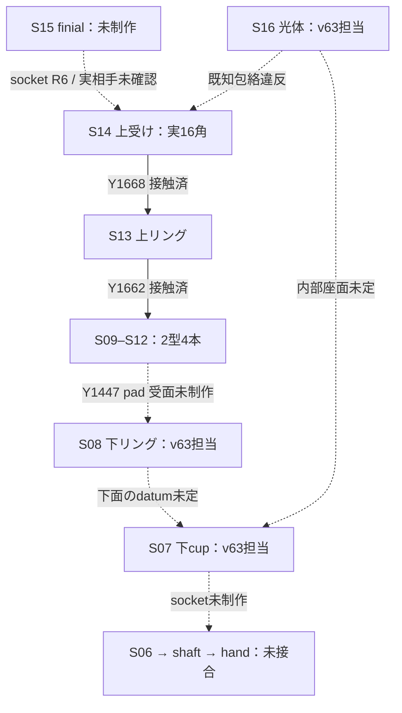
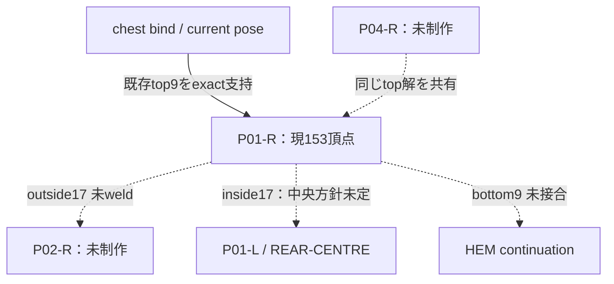
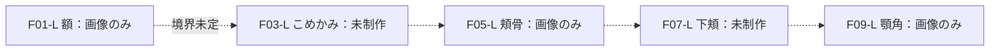

# v63 全微小部品の組立インターフェース監査

**現在の確定資料と微小候補だけで完成人物を組むことはできない。次工程を止める具体点は、灯具の旧台帳と実端面の不一致、P01の未接合中央・肩境界、顔パッチの未定共有辺である。** 以下は出所を知った設計監査で、匿名美観評価・ゲーム画面評価ではない。新造形を作らず、既存作者へ現在の制作に必要な拘束を返した。

## 基点・台帳の範囲

指定 remote `22d1d041dd6aef60de7764b1eebf6cf78028c857` と実読取 local HEAD `623535f6a5c039ba1482c18103da55085e03a995` は、共に tree `837c6b5dd804a33746e3a1116254bc5202c7dd6d`。checkoutはclean。fetch・checkout変更はしていない。26入力の exact hash は `SOURCE_HASHES.json`。

| 範囲 | 台帳の型/配置計画 | 固定treeの新微小形状候補 | 接合状態 |
|---|---:|---|---|
| 頭・髪 | 30 / 62 | geometry 0。F01-L/F05-L/F09-Lの参考曲面画像のみ | 共有辺・尺度登録が未定 |
| 衣服 | 34 / 79 | T01-R/S05-R/P01-R、3型3配置 | 3枚とも隣部品へ未weld。P01仮支持の死亡床侵入が既知 |
| 手・靴 | 21 / 90 | 新微小geometry 0 | 手首・指・靴口/足・杖把持の共有曲線未定 |
| 杖 | 18 / 19 | caps2型＋ribs2型、計4型6配置 | 上側6部品だけ接触確認。下受け・光体・shaft・handが未完 |

103型/250配置は草案の列数で、完成数・完成率ではない。実候補は7形状型/9配置だが、旧杖表はS09/S10、S11/S12を別型列に数え、実装はそれぞれ共有する。この分母の違いからも単純な「7/103完成率」は算出しない。保存済み粗い頭/衣装候補は未採用で、この新微小候補数へ足さない。

台帳正本入口は `docs/evidence/mira-micro-v61/PART_INDEX.json`。ただし `candidateFabricatedIds` はS13/S14の2個だけというv61の状態で止まっている。今回のscope別差分は `audit.json` へ記録し、元台帳を書き換えていない。

参照する下位計画は同 `planning/head/type-manifest.json` / `parts-draft.json`、`planning/cloth/types.json` / `PLAN.md`、`planning/accessories/STAFF_MICRO_BOM.json` / `HANDS_BOOTS_MICRO_PLAN.json`。clothの旧 `planning/cloth/parts.json` は212方眼・+X本人右という棄却案をなお含むので、現仕様に使わない。scope付きIDを維持し、head:F01とcloth:F01、cloth:S05とstaff:S05等を衝突させない。

## 1. 灯具：最短の接続は実ribs下端 → 新S08 → 新S07

図はソースの関係を示す仕様図で、幾何投影や実描画ではない。

旧STAFF_BOMのS08 torus中心Y1447・ribs端±14・上端Y1665は、v62実装の端面と一致しない。source `RIB_SPEC` を現在の接合正本にし、旧数字をそのまま新画像/meshへ持ち込まない。

- 座標は**杖モデル内のmm、Y軸、杖下端Y0**。cloth/headの座標へ単位換算だけで接続しない。
- 4下端の下面はY1447。半径方向15.25–18.25、接線方向±4 mm、角0.2 mm、一体端上/下面は各23.919998 mm²。S08の**上向き平坦座面**がこの全4面を実16角形で受ける。参考となる既確認のS13型座面はr14.5–19.2、同じangular phase。形を強制する値ではなく、実面包含を満たす一例。
- S08下面↔S07、S07下面↔S06、S07内部↔S16を別のinterfaceにする。S07の旧draft Y1427–1448・wall2mmだけでは、内底・光体接触・ribsとの非侵入を決められない。新しい内側profileとseat高さは作者値として明記する必要がある。
- S16は**1部品だけが光体を所有**。現設計包絡は中心(0,1556,0)、半径(52,109,39)mm、下極Y1447/上極Y1665。隠れた極の閉じ方・切欠き・取付面は原画像から未知。S14の実16角で最小normalized radius0.999408857、旧24角も0.999737878という既知違反を保持する。実S16表面ができたら「包絡との距離」「実相手との接触/侵入」を区別する。正規化量を実侵入mmへ置換せず、発光/遮蔽で不一致を隠して合格としない。
- 既存上側ribs↔S13 Y1662、S13↔S14 Y1668を保つ。S15球をS14へ再所有させない。S17/S18握り輪はS06首輪と別。4ribを5本に増やさない。

この拘束を制作担当combatへ直接送付済み。S07/S08/S16の新画像と新meshは現在担当中で、この固定treeの完成数には含めていない。

## 2. P01：上辺は固定できるが、左右・肩・裾は未接合

実 `surfaces.mjs` / `meshes.json` はchest bindのm、rootOffset=(0,.985,0)。P01 top9は頂点144–152、y=.430、x−.140..−.005、z−.2375..−.206m。制御列と全辺の実頂点・重みを `audit.json` に保存した。作者の支持修復はこの曲線を現在chest poseへexact固定し、元16control/153頂点/256triを変えない契約。

inside17は全てx=−.005m。単純な左右鏡像を作ると相手がx=+.005mで、**10mmの中央間隙**が残る。現候補が「未weld」としていることは正しい。将来、中央の共有1曲線へ登録するか、別の中央接続片を明示するかを決める必要がある。今回はこれを勝手に埋めない。

P04/P02/中央片の最終姿勢は、P01と同じ境界位置・重み・時間解を参照する一つのseam ownerを必要とする。隣り合う布を独立solverで近い位置へ動かしただけでは、静止時一致から動作時の無裂けを推論できない。UVは必要なら重複できるが、共有する位置と変形を二重所有しない。支持修復担当actorへこの点を直接送付済み。

T01/S05も上位alias（WAIST/CUFF/armhole）を持つが、相手はまだない。T01内側はFRONT-OPENなので、単に開辺を全て閉じる処理は誤り。S05はopen half-shellで、S06袖裏とCUFFを待つ。closed-solid検査を衣服の正しい開辺に一律要求しない。

## 3. 顔：F01/F05/F09は連続する3枚の完成皮膚ではない

台帳F01はF05を隣接に挙げるが、F05側の記載に逆向きの対応辺はない。F05とF09の間はF07を挟む。これは概念region表であって共有vertex/edgeの組立表ではない。3画像を互いに直接weldして顔を完成できる仕様にはなっていない。

次の造形前に必要なのは、head-localで既存顔ランドマークへ登録した**共通尺度、名前付き順序辺、同じ位置/接線/法線/skinweight**。55×55×25、40×35×40、38×35×45mmは草案のguideEnvelopeで、画像校正・板厚・採用寸法ではない。未定境界のmmをこの監査で作っていない。

画像は本人L=+Xの3patchを示す。裏の厚い囲い・鋭いベベルは模型表示であり、肌の内側wallとして複製しない。眼/瞼/口/髪・耳・首の所有を保持し、N01/N02はneck cutまで、collar/cowl/broochは衣服側。旧46点neck rimは再利用候補で、現微小部品の登録済み境界とは扱わない。

## 原bitmapの実見・未確認・返却範囲

採用/条件付き6枚を原byteのまま実見した：complete六方向、hands/staff、caps、ribs v2、cloth v2、head patches v2。全体像のstaffは本人右、正面画面左。body R=−X/L=+X/front=+Zを正本にし、旧code名のrightや杖局所±Xの英語left/rightを人体の確定根拠にしない。staff-to-handのmatrix/grip座標はこの微小assemblyでまだ固定していない。

capsの開口・sphere非所有、ribsの3方向に限定した形状参考と不成立TOP、clothの任意渦模様/内部hem、headの厚い裏縁をそれぞれ分離して見た。画像の明暗からmmの面位置や剛体投影の一致を導出していない。頭と衣服の完成姿との見た目一致も未判定。

短期の閉じ方は、現在動いている担当範囲の**灯具下側3型と既存6部品の接合**、**P01の現在上辺を守った支持**を別々に確定すること。両者を終えても顔・手・靴・未制作衣服・全体の接合が埋まるわけではない。全体表を作ったことや型数を品質証明に使わず、未知の相手を検査上だけ補って完了にしない。

本単位は源source読取・旧native結果の対応確認・既存JSON境界の独立再計算・原画実見。新native全sweep/新造形/画像生成/他owner編集/remote/WebGL再試行は0。公式GL Disabledを別経路で迂回していない。iPhone SE3・実材質/光影/動作の自然さ・PS4全画面・9/20達成の根拠は不足のまま。source hash、作業経過、終了状態はmanifest/closeへ保存した。
